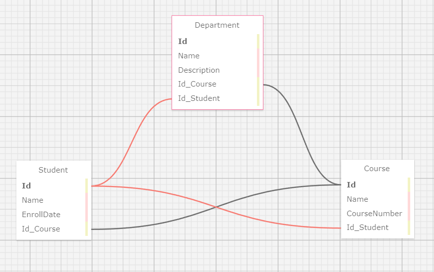

# _Many to Many Relationship_

#### By: 
_*Hans Ellis*_
_*Jonathan Liera*_
_*Peter Philavanh*_
_*Remy Flores*_

### College Registrar

## Technologies used

* _VS Code_
* _C#_
* _MySql Workbench_
* _Entity Framework Core v6.0.0_
* _Asp.Net Core MVC rendering_
* _Coca Cola_

## Description
This is a website designed for use by a college registrar to add students and courses and departments to a database. The user can manage relationships between them, linking students with courses and departments with the help of handy dropdown menus populated with objects from the database. Validation ensures that students cannot be created without association with at least one course and full CRUD functionality is available to all models. Design brought to you by custom css and bootstrap.

## Schema
_This image demonstrates the relationship between the many to many relationship_

## Setup/Installation Requirments

## Known Bugs
* _Adding a department to a student from student views does not work, adding a student from the department view however, will function correctly._

## Contact
_Hans Ellis: bullhorn@gmail.com_

## Licensing
This is licensed under the [MIT](https://opensource.org/licenses) license